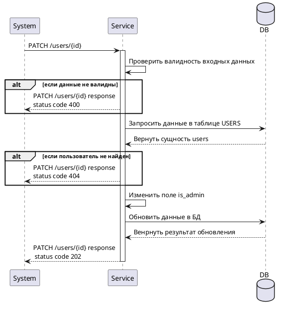

### Задачи
- Описать работу метод изменение прав пользователя
---
### Диаграмма



---

### Основной сценарий

1.  Система вызывает метод **PATCH /users/{id}**
	Входные параметры: 
		path параметр:
		
| Параметры | Тип     | Nullable | Ограничения | Описания                    | Пример |
| --------- | ------- | -------- | ----------- | --------------------------- | ------ |
| id        | integer | No       | N           | Индентификатор пользователя | 1      |
		body параметр:
		
| Параметры | Тип     | Nullable | Ограничения | Описания                                                         | Пример |
| --------- | ------- | -------- | ----------- | ---------------------------------------------------------------- | ------ |
| is_admin  | bollean | No       |             | Является ли пользователь администратором<br>Заполняется в ручную | false  |
2. Сервис проверят валидность входных данных
3. Сервис направляет запрос в таблицу USERS по USERS.id = id из path и возвращает сущность users
4. Сервис изменяет в полученной сущности поле is_admin = is_admin из запроса 
5. Сервис обновляет данные в БД 
6. Сервис возвращается ответ 
	В случае успешного выполнения вернуть только заголовок (**HTTP code = 202**)
	В случае не успешного выполнения вернуть заголовок (**HTTP code != 202**) и тело в формате:
	```json
	 {
	 "message": "error massage",
	 "status code": 400
	 }
```
---

### Негативные сценарии 
1.  В случае если система ввела не валидные данные, вернуть в теле ответа:
	```json
	 {
	 "message": "Falidation Error",
	 "status code": 400
	 }
	```
2. В случае если пользователь не был найден, вернуть в теле ответа:
	```json
	 {
	 "message": "Not Found",
	 "status code": 404
	 }
	```
	