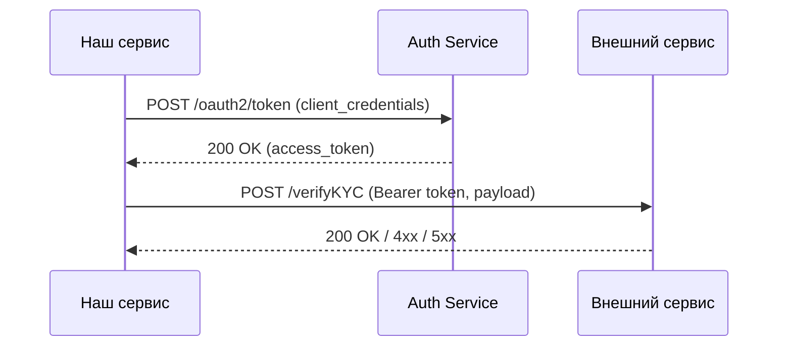

# Документация по интеграциям с внешними сервисами

## Содержание

- [1. Общие положения](#1-общие-положения)  
- [2. Архитектурная схема](#2-архитектурная-схема)  
- [3. Sequence-диаграмма](#3-sequence-диаграмма)  
- [4. Описание API](#4-описание-api)  
  - [4.1. POST /verifyKYC](#41-post-verifykyc)  
- [5. Аутентификация и авторизация](#5-аутентификация-и-авторизация)  
- [6. Контракты данных](#6-контракты-данных)  
- [7. SLA, мониторинг и алерты](#7-sla-мониторинг-и-алерты)  

---

## 1. Общие положения

В этом разделе описываются все аспекты взаимодействия нашего API с внешними системами (платежными шлюзами, сервисами KYC, маркет-данными и т.д.). Для каждой интеграции оформляется единая страница, содержащая:

- Назначение и область применения  
- Архитектурная схема и sequence-диаграмма  
- Описание REST-методов / потоков событий  
- Контракты данных (примеры request/response, JSON-schema)  
- Механизмы аутентификации и авторизации  
- Обработка ошибок и SLA  
- Мониторинг, логирование и алерты  

---

## 2. Архитектурная схема

  
*Пример: взаимодействие с внешним сервисом KYC*

---

## 3. Sequence-диаграмма


---

## 4. Описание API

### 4.1. POST /verifyKYC

Отправляет верификационные данные пользователя во внешний KYC-сервис.

**HTTP Request**

```bash
POST /verifyKYC
Host: api.bank.com
Authorization: Bearer {token}
Content-Type: multipart/form-data
```

**Параметры запроса**

|Параметр|Тип|Nullable|Ограничения|Описание|Пример|
|---|---|---|---|---|---|
|`userId`|string|N|UUID|ID пользователя|`123e4567-e89b-12d3-a456-426614174000`|
|`document`|file|N|PDF, ≤ 5 MB|Скан паспорта|—|

#### Успешный ответ (200 OK)

```json
{
  "status": "verified",
  "timestamp": "2025-05-28T12:34:56Z"
}
```

#### Ошибки

|Код|Описание|Пример ответа|
|---|---|---|
|401|Неавторизован|`{"error":"Unauthorized"}`|
|422|Валидация документа|`{"error":"InvalidDocument"}`|
|500|Внутренняя ошибка|`{"error":"ServerError","message":"…"}`|

---

## 5. Аутентификация и авторизация

Для взаимодействия с внешним API требуется OAuth2 Bearer Token:

```bash
POST /oauth2/token
grant_type=client_credentials&client_id=…&client_secret=…
```

**Ответ**

```json
{
  "access_token": "eyJhbGci…",
  "token_type": "Bearer",
  "expires_in": 3600
}
```

---

## 6. Контракты данных

**JSON-Schema запроса**

```json
{
  "$schema": "http://json-schema.org/draft-07/schema#",
  "type": "object",
  "properties": {
    "userId":    { "type": "string", "format": "uuid" },
    "document":  { "type": "string", "contentEncoding": "base64" }
  },
  "required": ["userId", "document"]
}
```

**JSON-Schema ответа**

```json
{
  "$schema": "http://json-schema.org/draft-07/schema#",
  "type": "object",
  "properties": {
    "status":    { "type": "string", "enum": ["verified", "rejected", "pending"] },
    "timestamp": { "type": "string", "format": "date-time" }
  },
  "required": ["status", "timestamp"]
}
```

---

## 7. SLA, мониторинг и алерты

- **Latency:** 95% запросов < 500 ms
    
- **Availability:** ≥ 99.9%
    
- **Логи ошибок:** записываются в ELK
    
- **Метрики:** экспортируются в Prometheus
    
- **Алерты:** в Slack при > 1% ошибок за 5 минут
    

---