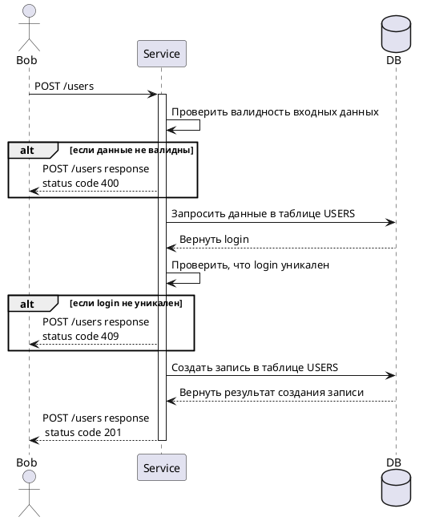

### Бизнес требование 

- Ввести сущность "Пользователь"
- Пользователь может быть администратором 
- У пользователя есть логин и пароль
- Каждый логин уникальный 
- Пароль состоит минимум из 8 символов используя латинский алфавит и цифры, где минимум 1 цифра и 1 заглавная буква
- ---
### Задачи

- Описать структуру БД
- Описать метод создания "Пользователя"
- Описать работу метода
---
### Функциональные требования

#### Общие описание 

Требуется описать метод для создания пользователя в БД 

---
### Таблица users 
![[Pasted image 20250526175811.png]]
### Диаграмма




---

### Основной сценарий 

1.  Пользователь вызывает метод **POST /users**
	Входные параметры:

| Параметры | Тип    | Nullable | Ограничения                                                                                                                                                                                                                                       | Описания                | Пример    |
| --------- | ------ | -------- | ------------------------------------------------------------------------------------------------------------------------------------------------------------------------------------------------------------------------------------------------- | ----------------------- | --------- |
| login     | string | No       | ANS допустимая длина 2..20 символов                                                                                                                                                                                                               | Логин пользователя      | Temlerg!2 |
| password  | string | No       | ^(?=.*\d)(?=.*[A-Z])(?=.*[!@#$%^&*?])[A-Za-z\d!@#$%^&*?]{8,30}$<br><br>Расшифровка рег. выражения:<br> - От 8 до 30 символов<br> - Обязательно 1 цифра<br> - Обязательно 1 спец. символ<br> - Обязательно 1 заглавная буква<br> - Только латиница | Пароль пользователя<br> | Slimhat1! |


2. Сервис проверяет валидность входных данных
3. Сервис направляет запрос в таблицу USERS по USERS.login = login из запроса и проверят, что такого login нет в БД
4. Сервис создает запись в таблице USERS
   
| Поля     | Тип данных  | Обязательность | Nullable | Ограничение                                                     | Логика заполнения   | Описание                                                             | Пример    |
| -------- | ----------- | -------------- | -------- | --------------------------------------------------------------- | ------------------- | -------------------------------------------------------------------- | --------- |
| id       | integer     | M              | No       | PK                                                              | Инкрементация       | Идентификатор пользователя                                           | 1         |
| login    | varchar(20) | M              | No       | UK                                                              | login из запроса    | Логин пользователя                                                   | Temlerg   |
| password | varchar(30) | M              | No       | ^(?=.*\d)(?=.*[A-Z])(?=.*[!@#$%^&*?])[A-Za-z\d!@#$%^&*?]{8,30}$ | password из запроса | Пароль пользователя<br>                                              | Slimhat1! |
| is_admin | bollean     | M              | No       | default = false                                                 | Не заполнятся       | Является ли пользователь администратором<br>Заполняется в ручную<br> | false     |

5. Сервер возвращает пользователю ответ 
	В случае успешного выполнения возвращает только заголовок (**HTTP code = 201**). 
	В случае не успешного ответа возвращает заголовок (**HTTP code != 201**) и тело в формате:
```json
	 {
	 "message": "Текст ошибки",
	 "status code": 400
	 }
```
---

### Негативные сценарии

1.  В случае если пользователь с таким login уже существует в БД, вернуть в теле ответа
	```json
	 {
	 "message": "Пользователь с таким login уже существует",
	 "status code": 400
	 }
	```
2.  В случае если пользователь ввел не валидные  данные, вернуть в теле ответа соответствует
	```json
	 {
	 "message": "Пароль не соответствует требованиям",
	 "status code": 409
	 }
	```
---

### Комментарии к методы
- Так как у нас не было требований по полю admin, то коллективом было принято решения -  **поле admin заполняется руками в БД** 
